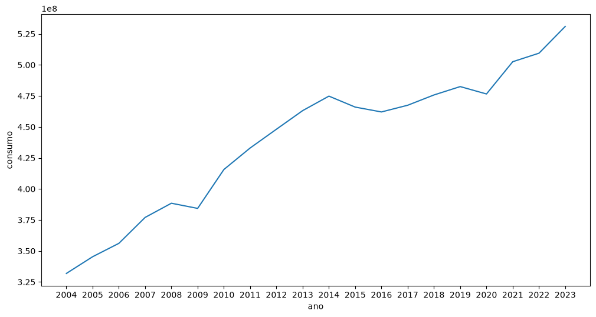
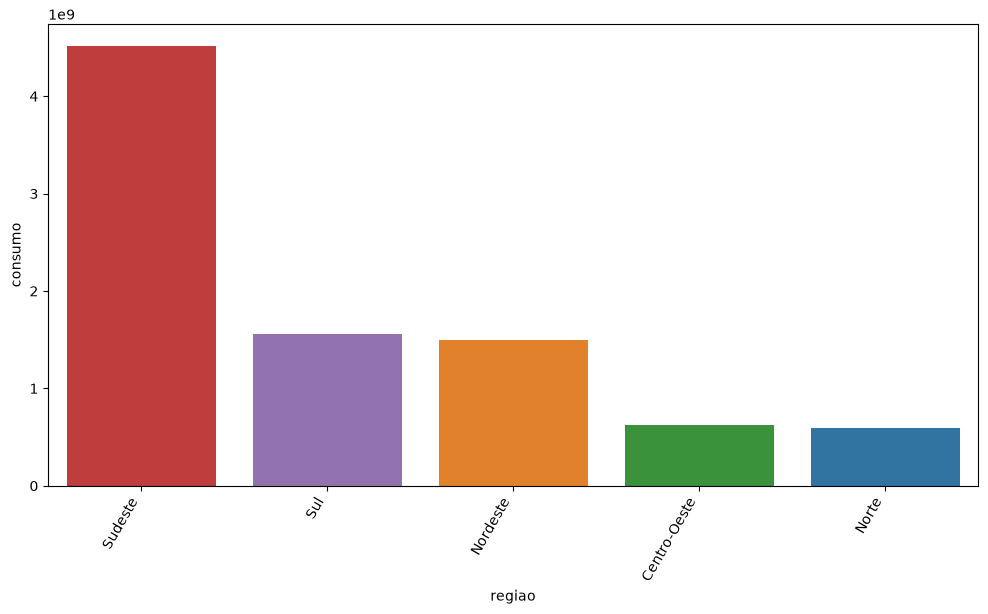

# Análise do Consumo de Energia Elétrica no Brasil

Projeto de análise exploratória de dados sobre o consumo de energia elétrica no Brasil entre **2004 e 2023**, desenvolvido como desafio final de Ciência de Dados.

O estudo investiga a evolução do consumo, as diferenças entre estados e regiões, os padrões mensais e o perfil das categorias de consumidores.

## Objetivos

- Analisar a evolução anual e os padrões mensais do consumo.
- Comparar o consumo entre estados, regiões e categorias.
- Comparar os valores de 2020 com a média de 2017 a 2019.
- Avaliar o crescimento regional e a participação das categorias no total nacional.
- Comparar o consumo médio mensal por consumidor em 2023.

## Dados

O projeto utiliza duas bases disponíveis na pasta `data/`:

| Arquivo | Conteúdo |
| --- | --- |
| `consumo_energia_eletrica.csv` | Ano, mês, unidade federativa, tipo de consumo, número de consumidores e consumo de energia. |
| `estado_regiao.csv` | Correspondência entre siglas, estados e regiões brasileiras. |

As bases são integradas pela sigla da unidade federativa. O notebook remove registros sem informação de número de consumidores e registros duplicados antes das análises.

## Etapas da análise

1. Carregamento e inspeção dos dados.
2. Tratamento de valores ausentes e duplicatas.
3. Integração das bases de consumo e de estados/regiões.
4. Estatísticas descritivas, distribuições e correlações.
5. Análises temporais, regionais e por categoria de consumo.
6. Síntese dos resultados e reflexão sobre suas aplicações.

## Principais resultados

Na base tratada e analisada no notebook:

- O consumo apresentou crescimento entre 2004 e 2023, com o maior total anual em 2023.
- O Sudeste e São Paulo se destacaram pelo volume consumido. Centro-Oeste e Norte apresentaram os maiores crescimentos percentuais no período.
- Junho apresentou o menor consumo médio dos registros; outubro, novembro e dezembro, os maiores.
- Em 2020, o consumo residencial ficou acima da média de 2017 a 2019 em todos os meses. Comércio e indústria apresentaram reduções em parte do ano em relação à mesma referência.
- A participação industrial passou de 47,1% para 35,5%, enquanto a residencial passou de 23,6% para 30,9%, entre 2004 e 2023.
- Em 2023, a indústria apresentou o maior consumo médio mensal por consumidor, e a categoria residencial, o menor.

Os gráficos, cálculos e interpretações estão no [notebook de análise](notebooks/EDA.ipynb).

## Visualizações

### Evolução anual do consumo



### Consumo por região



## Estrutura do projeto

```text
.
├── data/
│   ├── consumo_energia_eletrica.csv
│   └── estado_regiao.csv
├── images/
│   ├── evolucao-consumo.png
│   └── consumo-regiao.png
├── notebooks/
│   └── EDA.ipynb
├── src/
│   └── plots.py
├── .gitignore
└── README.md
```

O arquivo `src/plots.py` reúne funções reutilizáveis para gráficos de barras, linhas e mapas de calor de correlações.

## Tecnologias

- Python — notebook desenvolvido com Python 3.12.
- Pandas e NumPy — manipulação e análise de dados.
- Matplotlib e Seaborn — visualização de dados.
- Jupyter Notebook — execução e documentação da análise.

## Como executar

Com Python instalado, abra um terminal na raiz do projeto e instale as dependências:

```bash
python -m pip install pandas numpy matplotlib "seaborn>=0.12" notebook
```

Inicie o Jupyter a partir da pasta dos notebooks:

```bash
cd notebooks
python -m notebook
```

Abra `EDA.ipynb` e execute as células na ordem em que aparecem. O notebook utiliza caminhos relativos como `../data/` e `../src/`, por isso o diretório de execução deve ser `notebooks/`.

A base `estado_regiao.csv` é carregada com separador `;` e codificação `latin1`, conforme definido no notebook.

## Limitações

A análise é exploratória. As comparações identificam padrões e diferenças, mas não comprovam relações de causa e efeito com políticas públicas, eventos econômicos ou a pandemia. A remoção de registros sem número de consumidores também delimita os dados considerados nos resultados.

Os indicadores de consumo preservam a unidade original da base; o projeto não documenta sua unidade de medida nem a fonte original dos arquivos. As dependências não possuem versões fixadas em um arquivo de ambiente.
